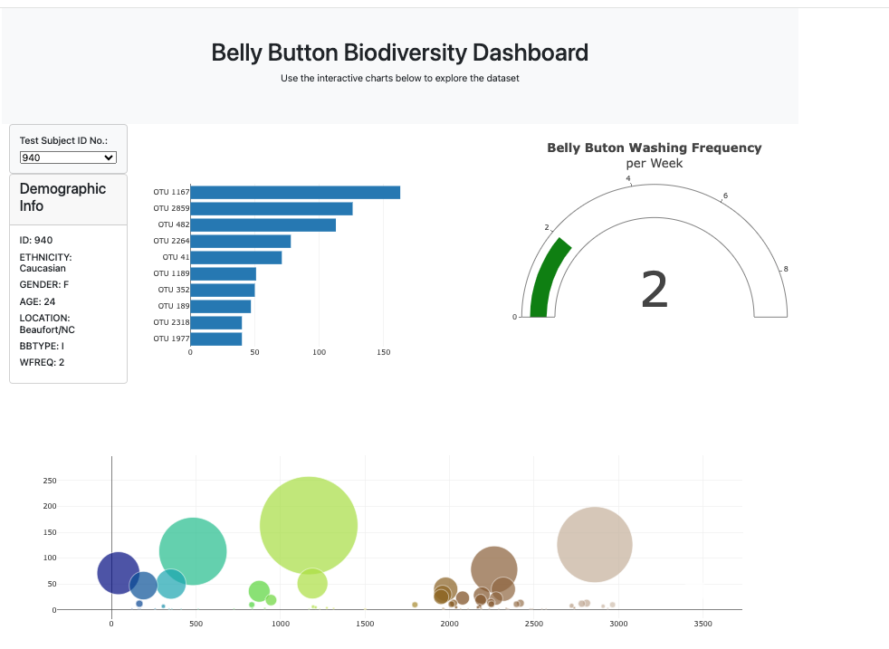

# Belly Button Dashboard

## Description
This dashboard visualizes data related to biodiversity.

## Table of Contents
- [Installation](#installation)
- [Usage](#usage)
- [Credits](#credits)
- [License](#license)
- [Features](#features)
- [Tests](#tests)
- [Contact](#contact)

## Installation
html,bootstrap,javascript,api

## Usage
run the index.html file

## Credits
Khristopher Prince

## License
MIT

## Features
It provides an interactive dashboard

## Tests
confirm bar chart, gauge and bubble chart display

## Contact
If there are any questions of concerns, I can be reached at:
##### [github: Khris51](https://github.com/Khris51)
##### [email: khris51@yahoo.com](mailto:khris51@yahoo.com)
